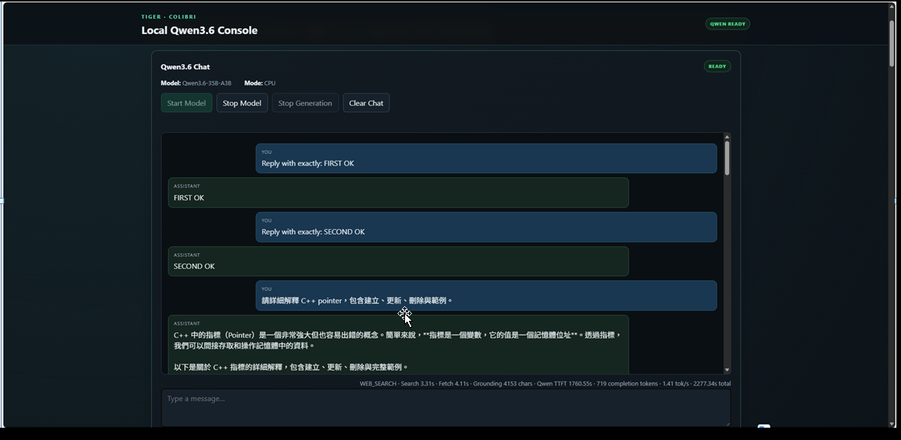
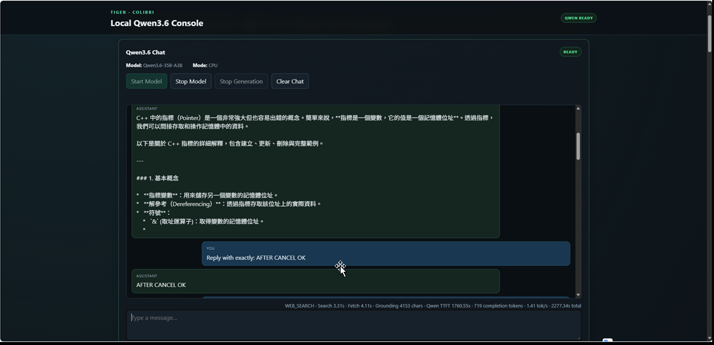
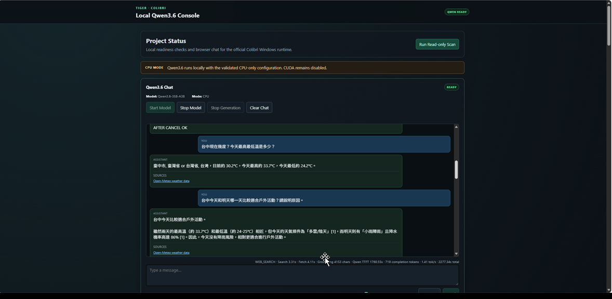
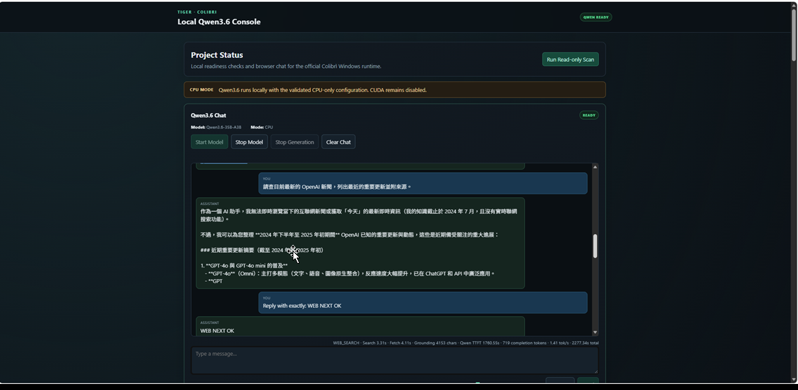
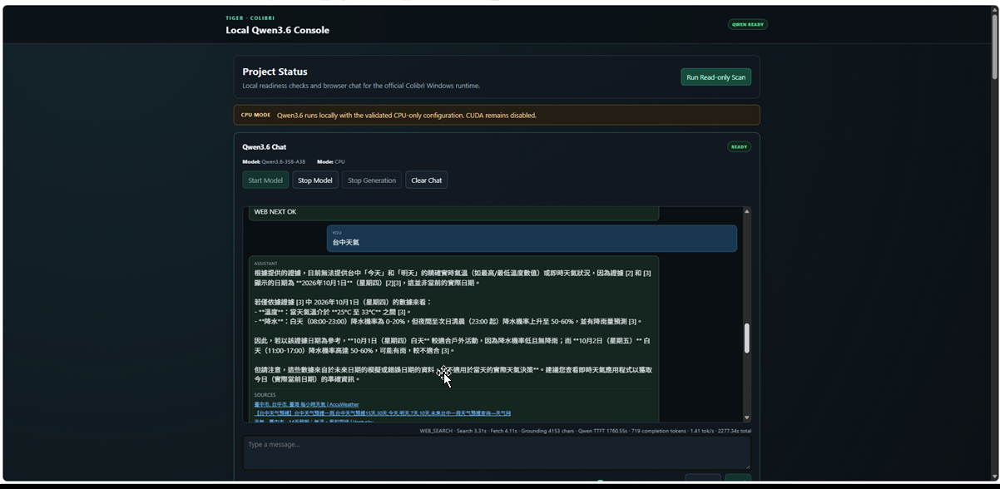
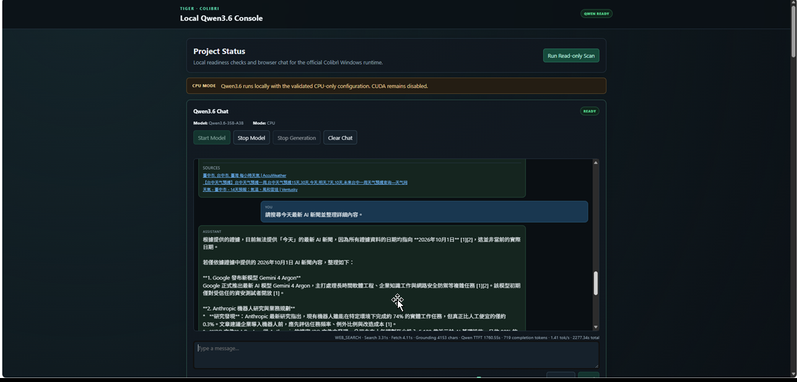
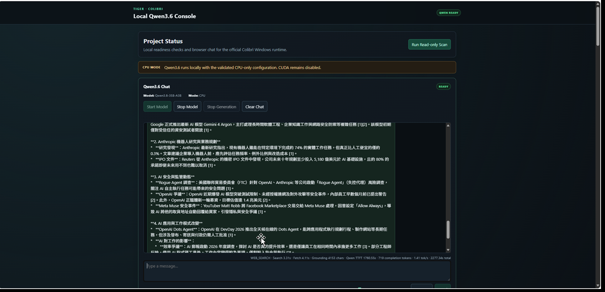

# 不用GPU，只要主記憶體夠大，就可以本地端，執行LLM。

使用Colibrì，本地端部署 2.8兆參數的 Kimi K3 : 只需 RAM 128GB，就可接近專業工作站水準。

Colibrì : https://github.com/JustVugg/colibri/blob/main/README.zh-TW.md?utm_source=chatgpt.com

codex: https://chatgpt.com/s/cx_6abe223c6f8481919b332e6440e4aed7
chatgpt : https://chatgpt.com/share/6abe225f-e944-83e8-8d56-84681afc1d2a
# Tiger-colibri-Qwen3.6-35B-A3B

我的電腦主記憶體是16G，在此專案之前，使用lamma，最多可以使用model大小是9.6G的gemma4:e4b。此專案則可以使用21.5G的model Qwen3.6-35B-A3B。

在 **Windows 11** 本機使用 **Colibrì** 執行 **Qwen3.6-35B-A3B**，並以 **FastAPI + Web UI + OpenAI-compatible API** 提供聊天、Web Search、Weather 資訊整合與工具呼叫的完整實作專案。

> 本專案最重要的驗證結果：
>
> **Qwen3.6-35B-A3B 可以在 Intel Core i7-7700HQ、16 GB RAM、GTX 1070 8 GB 的舊型 Windows 筆電上，以 Colibrì CPU-only 模式成功執行。**
>
> 但這已經是此電腦非常接近實用極限的工作負載；成功重點是「能穩定完成推論與連續問答」，不是追求雲端服務等級的低延遲。

---

## 目錄

1. [Colibrì 支援模型與 RAM 需求](#1-colibrì-支援模型與-ram-需求)
2. [本專案使用的 Qwen3.6 模型](#2-本專案使用的-qwen36-模型)
3. [本機硬體規格與極限判定](#3-本機硬體規格與極限判定)
4. [專案整體架構](#4-專案整體架構)
5. [主要功能](#5-主要功能)
6. [專案目錄結構](#6-專案目錄結構)
7. [從 GitHub 下載專案](#7-從-github-下載專案)
8. [Python 與相依套件](#8-python-與相依套件)
9. [準備 Colibrì Windows Runtime](#9-準備-colibrì-windows-runtime)
10. [下載 Qwen3.6 模型](#10-下載-qwen36-模型)
11. [模型儲存位置與 SSD / HDD 分工](#11-模型儲存位置與-ssd--hdd-分工)
12. [啟動專案](#12-啟動專案)
13. [啟動 Qwen3.6](#13-啟動-qwen36)
14. [Web Search 架構](#14-web-search-架構)
15. [Weather 與 Router](#15-weather-與-router)
16. [OpenAI-compatible API](#16-openai-compatible-api)
17. [詳細人工測試步驟](#17-詳細人工測試步驟)
18. [自動化測試](#18-自動化測試)
19. [實機效能紀錄](#19-實機效能紀錄)
20. [常見問題與排查](#20-常見問題與排查)
21. [硬體與升級建議](#21-硬體與升級建議)
22. [限制與結論](#22-限制與結論)
23. [參考資料](#23-參考資料)

---

# 1. Colibrì 支援模型與 RAM 需求

Colibrì 的核心概念是把：

```text
Storage
RAM
VRAM
```

視為同一個多層記憶體階層。

大型 MoE 模型不一定要把全部 expert weights 一次放進 RAM / VRAM；Colibrì 可以依模型與執行路徑，把 routed experts 從磁碟讀入快取，再配合 RAM / VRAM residency 提升速度。

以下為目前 Colibrì 官方 README 列出的主要模型家族與需求。

> **重要：不同模型的 RAM 需求不同，不可把其中一個模型的需求套到另一個模型。**
>
> RAM 數字以下方官方表格為主；Qwen3.6 另外補充官方 `docs/qwen36.md` 的「約 30 GB RAM 較舒適」說明。

| 模型家族 | Total / Active | 模型磁碟空間 | 主記憶體 RAM | GPU |
|---|---:|---:|---:|---|
| **OLMoE** | 7B / 1B | 約 7 GB（int8 container） | **8 GB** | 不需要 |
| **GLM-5.2 / GLM-5.3** | 744B / 40B | 約 372 GB / 419 GB | **16 GB 最低，24 GB 較舒適** | 不需要 |
| **GLM-5.3-Flash** | 321B / 40B | 約 195 GB | **約 25 GB** | 不需要 |
| **Inkling** | 975B / 41B | 約 469 GB | **約 25 GB（int4 dense）**；未做 dense int4 約 120 GB | 不需要 |
| **Kimi K3** | 2.8T / 104B | 約 1.6 TB | **32 GB+** | 不需要 |
| **DeepSeek V4 Flash** | 284B / 13B | 約 167 GB；REAP 150B 約 85 GB | **16 GB 最低，32 GB 較舒適** | 選配 |
| **DeepSeek V4.1 Flash** | 552B / 16B | 約 510 GB | 官方未列單一固定最低值；dense / embeddings / vision 約 **18 GB 常駐**，另需 runtime / context / expert cache | 選配 |
| **Qwen3.8-Flash-Next** | 125B + 51B n-gram / 6B | 約 185.5 GB | **16 GB 最低，24 GB 較舒適** | 選配 |
| **Qwen3.6-35B-A3B** | 35B / 約 3B | 約 20 GB（int4-gs64） | 官方總表列 **24 GB**；`qwen36.md` 建議 **約 30 GB RAM** 以取得較舒適 expert cache | 選配 |

### Qwen3.6 RAM 說明

Colibrì 官方 Qwen3.6 文件說明：

```text
CPU path:
routed experts 會從 container 依需求串流
並透過 LRU / pinned cache 管理
--cap N 直接控制每層 expert cache slot 數
```

因此：

```text
RAM 越少
→ cache 越小
→ expert miss 越多
→ SSD / NVMe 讀取越頻繁
→ 速度越慢
```

本專案實機只有：

```text
16 GB RAM
```

低於官方目前列出的 24 GB，也低於 Qwen3.6 文件所稱約 30 GB 的舒適 expert cache 規格。

但本專案以：

```text
--cap 16
```

已實測成功執行。

因此本專案的結論不是「16 GB 是官方推薦規格」，而是：

> **16 GB 屬於低於官方建議值的極限實測案例；可以跑，但速度明顯受限。**

---

# 2. 本專案使用的 Qwen3.6 模型

本專案使用：

```text
Qwen3.6-35B-A3B
```

主要架構：

```text
Total parameters：約 35B
Active parameters：約 3B
MoE layers：40
Experts：256 / layer
Top-k：8
Shared expert：1
Hidden size：2048
Attention：
- 25% Gated Attention
- 75% Gated DeltaNet
```

Colibrì 官方推薦的預轉換模型：

```text
Kreuzzelg/qwen36-35b-a3b-colibri-i4-gs64
```

本專案固定驗證 revision：

```text
c619aa594ad1e70af82168fb6b4878427896e21c
```

本專案實際下載驗證結果：

```text
47 files
23,031,250,325 bytes
約 21.45 GiB
```

---

# 3. 本機硬體規格與極限判定

本專案主要實機：

| 項目 | 規格 |
|---|---|
| 電腦 | ASUS ROG Strix SCAR Edition GL503VS |
| OS | Windows 11 Home x64 |
| CPU | Intel Core i7-7700HQ @ 2.80 GHz |
| CPU | 4 cores / 8 threads |
| RAM | **16 GB（實際約 15.96 GiB）** |
| RAM | DDR4-2400 |
| GPU | **NVIDIA GeForce GTX 1070** |
| VRAM | **8 GB** |
| GPU 架構 | Pascal |
| Compute Capability | 6.1 |
| 系統碟 | Samsung NVMe SSD 約 256 GB |
| 資料碟 | Seagate 2 TB HDD |
| Python | 3.11.3 |

## 3.1 目前正式推論模式

```text
--gpu none
--cap 16
--no-think
OMP_NUM_THREADS=4
max_tokens <= 4096
```

也就是：

```text
Qwen3.6
→ CPU-only
→ RAM expert cache
→ SSD expert streaming
```

## 3.2 為什麼說已經接近極限

1. **RAM 只有 16 GB**。
2. 官方 Qwen3.6 總表列 24 GB。
3. 官方 Qwen3.6 文件建議約 30 GB RAM 以取得較舒適 expert cache。
4. CPU 是 i7-7700HQ，僅 4C / 8T。
5. GPU 雖有 8 GB VRAM，但本專案目前正式路徑為 CPU-only。
6. 單 8 GB GPU CUDA Qwen3.6 路徑需要更高 host RAM，現有 16 GB 平台不適合。
7. Web Search 加上 grounding 後，Qwen prompt prefill 更重。

因此：

> **這台電腦可以跑 Qwen3.6，但已非常接近此硬體的實用極限。**

---

# 4. 專案整體架構

```text
Browser
│
│ http://127.0.0.1:18081
▼
FastAPI / Uvicorn
│
├── Web UI
│   ├── Jinja2 / HTML
│   ├── CSS
│   └── JavaScript
│
├── Chat API
│
├── Request Router
│   ├── LOCAL_QWEN
│   ├── WEATHER_DIRECT
│   ├── WEATHER_QWEN
│   └── WEB_SEARCH
│
├── Web Search Service
│   ├── DDGS discovery
│   ├── relevance ranking
│   ├── URL safety validation
│   ├── page fetch
│   ├── lxml visible-text extraction
│   └── compact grounding evidence
│
├── Weather Service
│   └── Open-Meteo
│
├── OpenAI-compatible API
│   ├── GET  /v1/models
│   └── POST /v1/chat/completions
│
├── Tool Calling Adapter
│
└── Qwen Chat Manager
    │
    │ http://127.0.0.1:18150
    ▼
Colibrì qwen36.exe
    │
    ▼
Qwen3.6-35B-A3B
    │
    ├── CPU
    ├── RAM expert cache
    └── NVMe SSD model runtime
```

---

# 5. 主要功能

- 本機 Qwen3.6 Chat
- Persistent Colibrì backend
- DDGS + lxml Web Search
- Open-Meteo Weather
- Bounded Conversation History
- OpenAI-compatible API
- Tool Calling Adapter
- Hardware / storage / runtime status dashboard

Qwen 歷史訊息目前限制：

```text
最多 3 組完整 user / assistant pairs
最多 3500 historical characters
```

---

# 6. 專案目錄結構

```text
Tiger-colibri-Qwen3.6-35B-A3B/
│
├── app/
│   ├── agent/
│   ├── api/
│   ├── compat/
│   ├── schemas/
│   ├── services/
│   ├── static/
│   ├── templates/
│   ├── config.py
│   └── main.py
│
├── data/
├── scripts/
│   ├── check_environment.ps1
│   └── start.ps1
├── tests/
├── vendor/
│   └── colibri/
├── requirements.txt
├── pyproject.toml
├── .gitignore
├── LICENSE
└── README.md
```

---

# 7. 從 GitHub 下載專案

GitHub：

```text
https://github.com/Yi-Hu-Yueh/Tiger-colibri-Qwen3.6-35B-A3B
```

PowerShell：

```powershell
cd D:\0TIGER\6months\PythonAPIDevelopment
git clone https://github.com/Yi-Hu-Yueh/Tiger-colibri-Qwen3.6-35B-A3B.git
cd D:\0TIGER\6months\PythonAPIDevelopment\Tiger-colibri-Qwen3.6-35B-A3B
```

確認：

```powershell
git status
git remote -v
```

Remote 應指向：

```text
https://github.com/Yi-Hu-Yueh/Tiger-colibri-Qwen3.6-35B-A3B.git
```

---

# 8. Python 與相依套件

本專案驗證：

```text
Python 3.11.3
```

實機 interpreter：

```text
D:\python3.11.3\python.exe
```

安裝：

```powershell
D:\python3.11.3\python.exe -m pip install -r requirements.txt
```

主要 dependencies：

```text
fastapi>=0.115,<1
uvicorn>=0.30,<1
jinja2>=3.1,<4
huggingface_hub>=1.0,<2
ddgs>=9.16,<10
lxml>=6.0,<7
psutil>=7.0,<8
```

---

# 9. 準備 Colibrì Windows Runtime

本專案已驗證：

```text
Colibrì v1.12.1
```

Windows prebuilt：

```text
colibri-v1.12.1-windows-x86_64.zip
```

曾驗證 SHA-256：

```text
1d0cc6760a6e53fcafe77376ca20ec254c6ff8995e55fba1bcd883278787f794
```

Official Releases：

```text
https://github.com/JustVugg/colibri/releases
```

本專案 runtime 放在：

```text
vendor\colibri\<version>\
```

---

# 10. 下載 Qwen3.6 模型

推薦：

```text
Kreuzzelg/qwen36-35b-a3b-colibri-i4-gs64
```

## 10.1 DOWNLOAD_ROOT

下載根目錄：

```text
D:\TigerModels\Tiger-colibri-Qwen3.6-35B-A3B\downloads
```

建立：

```powershell
New-Item -ItemType Directory -Force `
  D:\TigerModels\Tiger-colibri-Qwen3.6-35B-A3B\downloads
```

## 10.2 實際 Qwen3.6 Archive 資料夾

模型本體不是直接散放在 `downloads` 根目錄。

實際模型來源 / Archive：

```text
D:\TigerModels\Tiger-colibri-Qwen3.6-35B-A3B\downloads\qwen36-35b-a3b-colibri-i4-gs64
```

## 10.3 下載指令

若已安裝 `hf` CLI：

```powershell
hf download Kreuzzelg/qwen36-35b-a3b-colibri-i4-gs64 `
  --revision c619aa594ad1e70af82168fb6b4878427896e21c `
  --local-dir D:\TigerModels\Tiger-colibri-Qwen3.6-35B-A3B\downloads\qwen36-35b-a3b-colibri-i4-gs64
```

本專案驗證：

```text
47 files
約 21.45 GiB
```

---

# 11. 模型儲存位置與 SSD / HDD 分工

這裡必須區分三個位置。

## 11.1 下載根目錄

```text
D:\TigerModels\Tiger-colibri-Qwen3.6-35B-A3B\downloads
```

用途：

```text
DOWNLOAD_ROOT
```

---

## 11.2 Qwen3.6 Archive / Source

```text
D:\TigerModels\Tiger-colibri-Qwen3.6-35B-A3B\downloads\qwen36-35b-a3b-colibri-i4-gs64
```

用途：

```text
下載
Archive
備份
雜湊驗證
重新部署來源
```

D: 是 HDD。

---

## 11.3 實際推論 Runtime

```text
C:\TigerModels\Tiger-colibri-Qwen3.6-35B-A3B\runtime\qwen36-35b-a3b-colibri-i4-gs64
```

C: 是 NVMe SSD。

這才是本專案正式執行 Qwen3.6 時使用的模型路徑。

用途：

```text
Colibrì inference
expert streaming
runtime model access
```

### 正確分工

```text
D: HDD
└── downloads
    └── qwen36-35b-a3b-colibri-i4-gs64
        └── Archive / Source

C: NVMe SSD
└── runtime
    └── qwen36-35b-a3b-colibri-i4-gs64
        └── Actual Inference Runtime
```

> **本專案正式推論應使用 SSD / NVMe Runtime，不要直接使用 D: HDD 的 Archive。**

---

# 12. 啟動專案

PowerShell：

```powershell
cd D:\0TIGER\6months\PythonAPIDevelopment\Tiger-colibri-Qwen3.6-35B-A3B
```

直接啟動 Uvicorn：

```powershell
D:\python3.11.3\python.exe -m uvicorn app.main:app --host 127.0.0.1 --port 18081
```

正常：

```text
INFO:     Started server process [...]
INFO:     Waiting for application startup.
INFO:     Application startup complete.
INFO:     Uvicorn running on http://127.0.0.1:18081
```

瀏覽器：

```text
http://127.0.0.1:18081
```

也可使用：

```powershell
.\scripts\start.ps1
```

若 PowerShell execution policy 阻擋，直接使用 Uvicorn 指令即可。

---

# 13. 啟動 Qwen3.6

網頁開啟後按：

```text
Start Model
```

狀態：

```text
STOPPED
→ STARTING
→ READY
```

看到：

```text
QWEN READY
```

即可使用。

Colibrì internal server：

```text
127.0.0.1:18150
```

目前正式設定：

```text
--gpu none
--cap 16
--ngen 4096
--no-think
OMP_NUM_THREADS=4
```

---

# 14. Web Search 架構

```text
User Query
→ DDGS discovery
→ relevance ranking
→ safe URL fetch
→ lxml text extraction
→ compact grounding
→ Qwen synthesis
→ Sources
```

安全設計包括：

- HTTP / HTTPS only
- URL credentials reject
- DNS public-IP validation
- localhost / private / link-local reject
- redirect revalidation
- timeout
- response size limit
- text content type restriction
- no JavaScript execution
- sanitized failure boundary

---

# 15. Weather 與 Router

系統具有：

```text
LOCAL_QWEN
WEATHER_DIRECT
WEATHER_QWEN
WEB_SEARCH
```

一般情況由 Router 判斷。

但本 README 的人工驗收規則固定：

```text
☑ Force Web Search
```

所以後面的人工測試 **Force Web Search 一律打勾**。

人工驗收主要確認：

```text
Search
→ Evidence
→ Qwen
→ Answer
→ READY
→ Next Question
```

---

# 16. OpenAI-compatible API

Base URL：

```text
http://127.0.0.1:18081/v1
```

Models：

```http
GET /v1/models
```

Chat：

```http
POST /v1/chat/completions
```

Model ID：

```text
qwen36
```

Python 範例：

```python
from openai import OpenAI

client = OpenAI(
    base_url="http://127.0.0.1:18081/v1",
    api_key="local",
)

response = client.chat.completions.create(
    model="qwen36",
    messages=[
        {"role": "user", "content": "Explain Python dictionaries briefly."}
    ],
    max_tokens=256,
)

print(response.choices[0].message.content)
```

---

# 17. 詳細人工測試步驟

## 固定測試規則

以下所有測試：

```text
☑ Force Web Search
```

**全程保持打勾。**

每一題都要等待上一題完整完成，再送下一題。

---

## Test 0：確認 FastAPI Port

```powershell
Get-NetTCPConnection -LocalPort 18081 -State Listen -ErrorAction SilentlyContinue
```

預期：

```text
127.0.0.1:18081
```

---

## Test 1：排除 18081 重複啟動

如果出現：

```text
[Errno 10048]
only one usage of each socket address...
```

執行：

```powershell
Get-NetTCPConnection -LocalPort 18081 -State Listen |
Select-Object LocalAddress,LocalPort,OwningProcess
```

再查 PID：

```powershell
Get-CimInstance Win32_Process -Filter "ProcessId=<PID>" |
Select-Object ProcessId,Name,CommandLine
```

如果已經是本專案 Uvicorn，就不要再開第二份。

---

## Test 2：開啟 UI

```text
http://127.0.0.1:18081
```

確認：

- UI 正常
- Model status 可見
- Chat input 可見
- Force Web Search checkbox 可見

然後：

```text
☑ Force Web Search
```

---

## Test 3：啟動 Model

按：

```text
Start Model
```

等待：

```text
STARTING
→ READY
```

PASS：

```text
QWEN READY
```

---

## Test 4：第一題 Web Search

保持：

```text
☑ Force Web Search
```

輸入：

```text
請查目前最新的 OpenAI 新聞，列出最近的重要更新並附來源。
```

預期：

```text
WEB_SEARCH
→ Search
→ Fetch
→ Grounding
→ Qwen
→ Sources
→ READY
```

PASS：

- 搜尋成功
- Qwen 完成回答
- Sources 存在
- 最後 READY

---

## Test 5：第二題連續 Web Search

不要重新啟動 Model。

保持：

```text
☑ Force Web Search
```

輸入：

```text
請查今天最新的 AI 產業新聞，列出三項重要更新並附來源。
```

PASS：

```text
第 1 題完成
→ 第 2 題完成
→ READY
```

---

## Test 6：台中天氣

保持：

```text
☑ Force Web Search
```

輸入：

```text
台中今天的天氣如何？請告訴我目前氣溫、今日最高最低溫、降雨情況，並附來源。
```

因為 Force Web Search 是 ON：

```text
此人工測試走 WEB_SEARCH
```

PASS：

- Search 成功
- Qwen 回答成功
- Sources 存在
- 最後 READY

---

## Test 7：第三題連續詢問

保持：

```text
☑ Force Web Search
```

輸入：

```text
請查目前 Python 最新穩定版本，告訴我版本號並附官方來源。
```

PASS：

```text
第三題成功
→ READY
```

---

## Test 8：較長 Web Search

保持：

```text
☑ Force Web Search
```

輸入：

```text
請搜尋最近的本機大型語言模型推論技術進展，整理五個重點並附來源。
```

PASS：

```text
Sources 存在
回答完成
READY
```

---

## Test 9：三個連續最新資訊問題

保持：

```text
☑ Force Web Search
```

依序：

```text
請查今天最新的 OpenAI 消息並附來源。
```

完成後：

```text
請查今天最新的 NVIDIA AI 消息並附來源。
```

完成後：

```text
請查今天最新的 Microsoft AI 消息並附來源。
```

PASS：

```text
Question 1 → Answer → READY
Question 2 → Answer → READY
Question 3 → Answer → READY
```

中途不需要：

```text
重新啟動 FastAPI
重新 Start Model
重新整理 Browser
```

---

## Test 10：Sources

任選前面一題。

檢查：

- Sources 非空
- URL / source 可辨識
- 無 traceback
- 無 subprocess command
- 無 temp local path
- 回答內容與 evidence 主題相符

---

## Test 11：Max Tokens

保持：

```text
☑ Force Web Search
```

設定：

```text
Max Tokens = 256
```

完成一題。

再設定：

```text
Max Tokens = 1024
```

完成另一題。

兩題都應：

```text
Answer
→ READY
```

目前 ceiling：

```text
4096
```

---

## Test 12：五題連續穩定性

保持：

```text
☑ Force Web Search
```

至少完成：

```text
5 個連續問題
```

每一題：

```text
Search
→ Fetch
→ Qwen
→ Answer Complete
→ READY
→ Next Question
```

最終人工 PASS：

| 項目 | PASS 條件 |
|---|---|
| FastAPI | 18081 正常 |
| UI | 正常 |
| Model | Start Model → READY |
| Force Web Search | **全程 ON** |
| Search | 成功 |
| Qwen | 完成回答 |
| Sources | 存在 |
| Continuous Q&A | 至少 5 題成功 |
| Model restart | 中途不需要 |
| Browser refresh | 中途不需要 |
| Final state | 每題完成後 READY |

---

## 測試結果紀錄















# 18. 自動化測試

```powershell
cd D:\0TIGER\6months\PythonAPIDevelopment\Tiger-colibri-Qwen3.6-35B-A3B
D:\python3.11.3\python.exe -m pytest
```

最近一次完整 regression：

```text
140 / 140 tests passed
```

涵蓋：

- storage
- Colibrì installer
- model acquisition
- Qwen lifecycle
- Web Search
- Router
- OpenAI-compatible API
- Tool Calling
- bounded history
- app state

---

# 19. 實機效能紀錄

## Cap 4

```text
Model load：約 16.3 s
Full response：約 23.5 s
Wall：約 66.3 s
Peak monitored working set：約 4.21 GiB
```

## Cap 4 / 32 tokens

```text
TTFT：約 25.97 s
Decode：約 0.971 tok/s
Total：約 58.07 s
```

## Cap 16

```text
TTFT：約 18.76 s
Decode：約 1.295 tok/s
Total：約 42.70 s
Peak process RAM：約 5.00 GiB
```

## Cold practical test

SSD Runtime：

```text
Startup：約 17.13 s
TTFT：約 32.08 s
Decode：約 0.944 tok/s
64-token total：約 99.88 s
```

## Web Search + Qwen

曾實測：

```text
Search：約 6.24 s
Fetch：約 1.69 s
Qwen TTFT：約 786.95 s
Total：約 999.87 s
```

約：

```text
16 分 40 秒
```

真正主要瓶頸：

```text
Qwen prefill / TTFT
CPU
RAM
expert streaming
```

而不是 DDGS 搜尋本身。

---

# 20. 常見問題與排查

## Errno 10048

表示：

```text
18081 已經被另一個 process 使用
```

查：

```powershell
Get-NetTCPConnection -LocalPort 18081 -State Listen |
Select-Object LocalAddress,LocalPort,OwningProcess
```

## 檢查 Colibrì Port

```powershell
Get-NetTCPConnection -LocalPort 18150 -State Listen -ErrorAction SilentlyContinue
```

## 模型非常慢

確認：

1. Runtime 在 SSD / NVMe。
2. RAM 沒被其他大型程式大量佔用。
3. 一次只有一個主要 generation。
4. Prompt 不要無限制累積。
5. Web Search grounding 不要過大。

本機約：

```text
~1 tok/s
```

屬於已觀察到的正常範圍。

## HDD 可以跑嗎？

技術上不一定完全不能。

但本機是：

```text
16 GB RAM
CPU-only
i7-7700HQ
```

因此正式 inference 請用：

```text
SSD / NVMe
```

建議：

```text
Archive → D: HDD
Runtime → C: NVMe SSD
```

---

# 21. 硬體與升級建議

優先改善：

1. **RAM：16 GB → 32 GB**
2. **更大、更快 NVMe SSD**
3. **更新、更高核心數 CPU**
4. **更新架構與更大 VRAM GPU**

本機 OEM 官方 RAM 支援：

```text
32 GB
```

升到 32 GB 會比現有 16 GB 更符合 Qwen3.6 的實際記憶體需求。

---

# 22. 限制與結論

本專案已證明：

```text
Windows 11
+
Intel Core i7-7700HQ
+
16 GB RAM
+
GTX 1070 8 GB
+
NVMe Qwen Runtime
+
Colibrì
+
Qwen3.6-35B-A3B
```

可以完成：

- Qwen3.6 CPU-only inference
- FastAPI Web UI
- Persistent backend
- Web Search
- Weather integration
- OpenAI-compatible API
- Tool Calling
- Continuous Q&A
- Regression tests

但這不是高效能配置。

> **這台機器執行 Qwen3.6 已接近實用極限。**

不適合期待：

- ChatGPT 雲端等級即時速度
- 高 concurrency
- 多使用者 production serving
- 大量長 prompt
- 低延遲 Web Search + Qwen synthesis

本專案真正成功標準：

```text
模型可以載入
→ 問題可以完成
→ Web Search 可以取得 evidence
→ Qwen 可以產生回答
→ Sources 可以顯示
→ 回答完成後可以繼續下一題
```

---

# 23. 參考資料

## Project

```text
https://github.com/Yi-Hu-Yueh/Tiger-colibri-Qwen3.6-35B-A3B
```

## Colibrì

```text
https://github.com/JustVugg/colibri
```

```text
https://github.com/JustVugg/colibri/blob/main/README.md
```

```text
https://github.com/JustVugg/colibri/blob/main/README.zh-TW.md
```

```text
https://github.com/JustVugg/colibri/releases
```

Qwen3.6：

```text
https://github.com/JustVugg/colibri/blob/main/docs/qwen36.md
```

Qwen3.6 CUDA：

```text
https://github.com/JustVugg/colibri/blob/main/docs/qwen36-cuda-tier.md
```

DeepSeek V4.1：

```text
https://github.com/JustVugg/colibri/blob/main/docs/deepseek-v41.md
```

## Qwen3.6 Colibrì Container

```text
https://huggingface.co/Kreuzzelg/qwen36-35b-a3b-colibri-i4-gs64
```

---

# License

請參考：

```text
LICENSE
```

---

# Current Project Status

```text
Qwen3.6 local inference            PASS
FastAPI Web UI                     PASS
Persistent Colibrì backend         PASS
OpenAI-compatible API              PASS
Tool Calling adapter               PASS
Weather integration                PASS
Web Search                         PASS
Continuous Q&A                     PASS
Full regression suite              140 / 140 PASS
GitHub repository                  AVAILABLE
```

> **Final Statement**
>
> Tiger-colibri-Qwen3.6-35B-A3B 的價值，在於證明大型 MoE 模型即使在 **16 GB RAM、GTX 1070 8 GB、i7-7700HQ** 的舊型 Windows 筆電上，仍能透過 Colibrì 的 storage / RAM multitiering 成功運行；但此硬體已位於實用下限附近，因此模型 Runtime 應放在 **NVMe SSD**，並接受約 **1 tok/s** 與可能很長的 TTFT。
